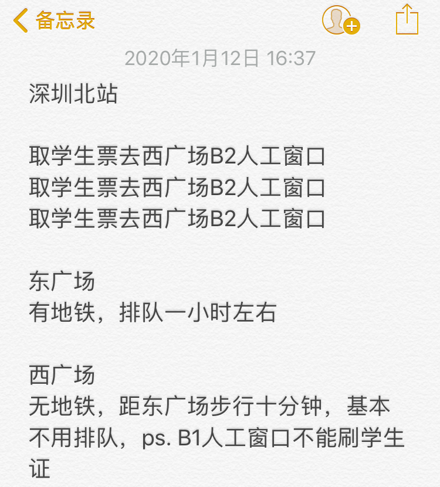

> {{ page.description }}

20年春节的车票，比往年难抢一些。而那些抢到票的同学，又遇到了别样的难题——票是买到了，车却上不了。

*可以直接阅读第二节，操作指南。*

<!--more-->

## 悲惨遭遇

经过不正经统计，由于~~火车票票务改革~~磁卡问题，19年入学南燕的信工学子遇到了如下两种情况。

*下面票、学生票皆指的是原车票模样，但多出“仅供报销使用”一行字的报销凭证，可用于在上车时走人工通道。*

情况一：学生资质绑定没有错误。

具体表现为在自助售票机上，能够使用学生证和身份证正常绑定学生资质。此情况下的同学最为幸运，在自助机器上绑定学生资质之后，在自助机器上可以取学生票，也一定可以在人工窗口取票。

情况二：学生资质绑定出错。

具体表现为在自助售票机上无法绑定学生资质。此情况下的同学更为幸运，中了头奖。绑定学生资质时会提示缺失身份证号，或者区间出错等信息。此情况为学生证的火车票优惠卡有错误，比如磁卡是乱码读不出来，或者填写时填错/新旧站名更换。此时去人工窗口取票需要看工作人员的判断，**不一定**给取票，毕竟不是火车站的错，一般是学校教务的锅。

## 操作指南

*下面票、学生票皆指的是原车票模样，但多出“仅供报销使用”一行字的报销凭证，可用于在上车时走人工通道。*

万无一失的保险方案：去 H 栋自助机验证学生证是否出错，如果出错就重新刷入磁卡。提前几天或留出一小时进行取票、绑定学生资质。入站时如果无法刷身份证入站，就持票走人工通道。详细版解释见下。

> 我要怎么检查自己的学生证有没有错？

一个简单的方法就是去 H 栋一楼大厅（ H 栋位于 A 栋对边，学校大门前马路的另一侧），两个学籍自助机之间有个小机子，刷一下学生证即可显示学生姓名、“北京大学”以及剩余次数。如果只显示“北京大学”，没有学生姓名，说明学生证有错误。

还有一个复杂的方法，就是直接去车站绑定学生资质，提示各种问题无法绑定的学生证即有错误。

> 我的学生证出错，我该怎么办？

在工作时间，找 H 栋 H103 的杨老师，重新刷入磁卡信息。

> 我该怎么绑定学生资质和取票？

在自助售票机可以绑定学生资质以及取票，或者在人工窗口取学生票，工作人员会先帮忙绑定。 [《学生票资质核验》](https://mp.weixin.qq.com/s/_ODExgXs_8eAXnNiKN31Wg)一文有绑定资质的操作说明。需要注意的是，并不是所有的自助售票机都能绑定。如果刷学生证时没有反应，可以换一台自助机试试。

> 我能刷身份证入站吗？

经测试深圳北站可以用身份证刷入（即使购票是在绑定资质之前）。如果是该学年第一次购票，还是**建议**绑定学生资质后取出学生票，以免无法刷身份证入站而误车。之后三次购票应当是可以直接刷身份证入站。

> 人在车站，时间紧迫，学生证出错，咋办？

去人工窗口取学生票，如果不让取票，应当可以补全票价，取全价票。

## 热心说明

### 深圳北西广场人少票多速来

深圳北站有两个广场，都设有人工窗口和许多自助售取票机。由于西广场人迹罕至，取票者甚少，故推荐大家多走两步路，~~为祖国健康工作五十年，~~去**西广场的人工窗口**进行绑定资质取票等操作。注意，图上推荐去B2的人工窗口，但是有同学反应说B2窗口无法核验学生资历，推荐去B1的人工窗口。当然，最便捷的方式应该是自动售取票机的学生资质绑定。

如果是乘坐地铁，则是在上了扶梯到达东广场（下图右侧的起点）后向北走，之后转弯直走，穿过一个长长的走廊，再往南走一点，就到达了西广场。整个路径如下图所示。

### 火车票务改革何苦为难学生

大家每学年第一次的车票都要先绑定学生资质，绑定前买的票必须提前取票才可进站（此处的票是指进站凭证），之后三次可以直接刷身份证。

详情可查看 12306 的微博，或者操作指南中提到的《学生票资质核验》一文。

## 致谢

- 热心同学@Leo 是第一位学生证中奖之后向大家分享经验的同学。

- 热心同学@神奇的西瓜 向大家分享西广场人少，节省时间。

- 热心同学@荆 分享了之前学生证出错的处理方式，以及提示自助售票机也可取票。

- 热心同学@婷格 确认了出错时的负责老师，以及提示信工学院的学生证写卡出错，中奖情况较多。

- 热心同学@Seven 首先分享学生证验证的简单方法。

- 热心同学@予 分享了自己的购票过程以及取票重点。

- 热心同学@Anyhow 分享了代售点取票的途径，未列入正文是因为现已失效。

- 热心同学@对不起借过一下，@颜颜颜，@🍭，@军军，@驿，@水镜，@L.L，@ ，@秀老婆，@JyYang，@Claire，@我太惨了几乎没有人感谢自己这究竟是人性还是道德，@Arosky，@轲 参与讨论或者十分热心地回答问题，但是我太懒了没有一一说明贡献还请见谅。

十分感谢以上热心同学，无私地帮助他人。同时如果有疏漏或者言语不周，请务必联系我。

---

*本文成文于2020年1月12日，最近修改于1月17日，最新版可查看博客[suith.xyz](https://suith.xyz//train-tickets-in-pkusz)。如有建议或意见，可邮件联系i[at]suith.xyz（其中[at]需替换为@）。*